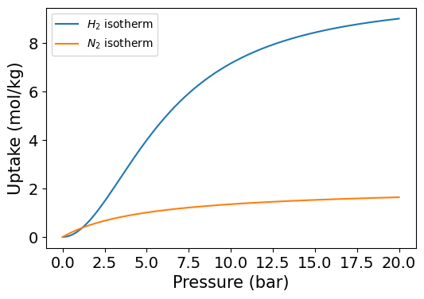

Examples
========

Here are some examples.

1. Ideal PSA simulation for green hydrogen production
'''''''''''''''''''''''''''''''''''''''''''''''''''''''

Because green ammonia is currently the favored transportation medium for carbon-free hydrogen, H\ :sub:`2` separation and purification technologies have gained increasing attention. Among the various options for H\ :sub:`2` separation, pressure swing adsorption (PSA) has the highest technological readiness level. Therefore, this example handle the ideal PSA simulation to produce H\ :sub:`2` decomposed from green NH\ :sub:`3` and determine the hydrogen recovery of the columns given adsobents properties.

.. image:: images/GreenNH3_process.png
  :width: 800
  :alt: GreenNH3 process
  :align: center

H\ :sub:`2` produced in regions rich in renewable energy is transported to other locations in the form of NH\ :sub:`3`, and H\ :sub:`2` is produced by decomposing NH\ :sub:`3` into a mixture of N\ :sub:`2` and H\ :sub:`2`. The NH\ :sub:`3` reactor and residual NH\ :sub:`3` removal system are located before the PSA system. Thereafter, the 0.25% of unreacted NH\ :sub:`3` exiting the reactor is cooled and removed with a batch type uni-bed adsorption tower. Therefore, the gas entering the target PSA process was assumed to be 25 mol% N\ :sub:`2` and 75 mol% H\ :sub:`2`.

**First, import pyAPEP packages.**

.. code-block:: python

   import pyAPEP.isofit as isofit
   import pyAPEP.simide as simide

.. _isothrm_definition:

**Then, define pure isotherm function for hydrogen and nitrogen using pressure-uptake data samples (Opt. 1) or isotherm parameters (Opt. 2).**

.. code-block:: python

   # Find hydrogen isotherm (Opt. 1)
   # Data import
   P = [2, 3, 4, 5]
   q = [1, 2, 3, 4]

   # Find best isotherm function
   H2_isotherm, par_H2, fn_type_H2, val_err_H2 = isofit.best_isomodel(P, q)

   # Define nitrogen isotherm (Opt. 2)
   # Data import
   par_N2 = [2, 0.2, 0.0002]

   def Quad(par, P, T):
    nume = par[0]*(par[1]*P + 2*par[2]*P**2)
    deno = 1 + par[1]*P + par[2]*P**2
    q = nume/deno
    return q

   N2_isotherm = lambda P,T: Quad(par_N2, P, T)

**Check developed pure isotherm functions.**

**We need mixture isotherm function to simulate PSA process. Here we define the hydrogen/nitrogen mixture isotherm with :py:mod:`isofit.IAST`**

.. code-block:: python

   iso_list = [H2_isotherm, N2_isotherm]
   iso_mix = lambda P,T : isofit.IAST(iso_list, P, T)

**Then we need to define and run ideal PSA process.**

.. code-block:: python

   CI1 = simide.IdealColumn(2, iso_mix, )

   # Feed condition setting
   P_feed = 8      # Feed presure (bar)
   T_feed = 313.15    # Feed temperature (K)
   y_feed = [3/4, 1/4] # Feed mole fraction (mol/mol)
   CI1.feedcond(P_feed, T_feed, y_feed)

   # Operating condition setting
   P_high = 8 # High pressure (bar)
   P_low  = 1 # Low pressure (bar)
   CI1.opercond(P_high, P_low)

   # Simulation run
   x_tail = CI1.runideal()
   print(x_tail)       # Output: [x_H2, x_N2]

**Now, we can calculate hydrogen recovery for this system. The definition of recovery is the ratio of target material between product and feed flow. The recovery is derived below.**

.. math::

    R_{H_2} = \frac{(H_2 \textrm{ in feed})-(H_2 \textrm{ in tail gas})}{H_2 \textrm{ in feed}} = \frac{y_{H_2}\,F_{feed}-x_{H_2}\,F_{tail}}{y_{H_2}\,F_{feed}}

**By the assumptions of ideal PSA columns, hydrogen mole fraction in raffinate is 1 (100 mol%). Mass balance eqaution for nitrogen becomes,**

.. math::

    y_{N_2}\cdot F_{feed} = x_{N_2}\cdot F_{tail},

.. math::

    F_{tail} = \frac{y_{N_2}}{x_{N_2}} \cdot F_{feed}

**Substituting above mass balance to recovery equation then,**

.. math::

    R_{H_2} = \frac{(1-y_{N_2})F_{feed} - (1-x_{N_2})F_{tail}}{(1-y_{N_2})F_{feed}} = 1 - \frac{y_{N_2}(1-x_{N_2})}{x_{N_2}(1-y_{N_2})}

.. code-block:: python
   
   # Calculate H2 recovery
   y_N2 = y_feed[1]
   x_N2 = x_tail[1]
   R_H2 = 1- (y_N2*(1-x_N2))/(x_N2*(1-y_N2))

   print(R_H2)

------------------------------------------------------------------------

2. Real PSA simulation for biogas upgrading
'''''''''''''''''''''''''''''''''''''''''''''''

기본설명 (주의 환기)

.. image:: images/GreenNH3_process.png
  :width: 800
  :alt: GreenNH3 process
  :align: center

공정설명

**First, import pyAPEP packages.**

.. code-block:: python

   import pyAPEP.isofit as isofit
   import pyAPEP.simide as simide

**Then, define pure isotherm function for hydrogen and nitrogen using pressure-uptake data samples (Opt. 1) or isotherm parameters (Opt. 2).**

여기로 가서 isotherm function 을 동일하게 정의하세요. :ref:`here <isothrm_definition>`

**We need mixture isotherm function to simulate PSA process. Here we define the hydrogen/nitrogen mixture isotherm with :py:mod:`isofit.IAST`**

.. code-block:: python

   iso_list = [H2_isotherm, N2_isotherm]
   iso_mix = lambda P,T : isof.IAST(iso_list, P, T)

**Then we need to define and run ideal PSA process.**

.. code-block:: python

   CI1 = simi.IdealColumn(2, iso_mix, )

   # Feed condition setting
   P_feed = 8      # Feed presure (bar)
   T_feed = 313.15    # Feed temperature (K)
   y_feed = [3/4, 1/4] # Feed mole fraction (mol/mol)
   CI1.feedcond(P_feed, T_feed, y_feed)

   # Operating condition setting
   P_high = 8 # High pressure (bar)
   P_low  = 1 # Low pressure (bar)
   CI1.opercond(P_high, P_low)

   # Simulation run
   x_tail = CI1.runideal()
   print(x_tail)       # Output: [x_H2, x_N2]

**Now, we can calculate hydrogen recovery for this system. The definition of recovery is the ratio of target material between product and feed flow. The recovery is derived below.**

.. math::

    R_{H_2} = \frac{(H_2 \textrm{ in feed})-(H_2 \textrm{ in tail gas})}{H_2 \textrm{ in feed}} = \frac{y_{H_2}\,F_{feed}-x_{H_2}\,F_{tail}}{y_{H_2}\,F_{feed}}

**By the assumptions of ideal PSA columns, hydrogen mole fraction in raffinate is 1 (100 mol%). Mass balance eqaution for nitrogen becomes,**

.. math::

    y_{N_2}\cdot F_{feed} = x_{N_2}\cdot F_{tail},

.. math::

    F_{tail} = \frac{y_{N_2}}{x_{N_2}} \cdot F_{feed}

**Substituting above mass balance to recovery equation then,**

.. math::

    R_{H_2} = \frac{(1-y_{N_2})F_{feed} - (1-x_{N_2})F_{tail}}{(1-y_{N_2})F_{feed}} = 1 - \frac{y_{N_2}(1-x_{N_2})}{x_{N_2}(1-y_{N_2})}

.. code-block:: python
   
   # Calculate H2 recovery
   y_N2 = y_feed[1]
   x_N2 = x_tail[1]
   R_H2 = 1- (y_N2*(1-x_N2))/(x_N2*(1-y_N2))

   print(R_H2)
