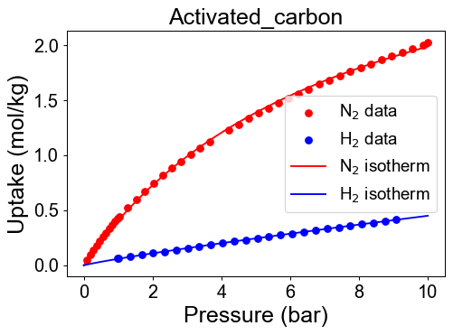
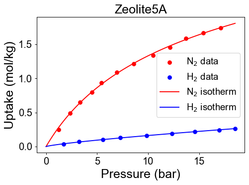

Examples
========

Here are some examples.

1. Ideal PSA simulation for green hydrogen production
'''''''''''''''''''''''''''''''''''''''''''''''''''''''

**Background**
Because green ammonia is currently the favored transportation medium for carbon-free hydrogen, H\ :sub:`2` separation and purification technologies have gained increasing attention. Among the various options for H\ :sub:`2` separation, pressure swing adsorption (PSA) has the highest technological readiness level. Therefore, this example handle the ideal PSA simulation to produce H\ :sub:`2` decomposed from green NH\ :sub:`3` and determine the hydrogen recovery of the columns given adsobents properties.

**Process description**
H\ :sub:`2` produced in regions rich in renewable energy is transported to other locations in the form of NH\ :sub:`3`, and H\ :sub:`2` is produced by decomposing NH\ :sub:`3` into a mixture of N\ :sub:`2` and H\ :sub:`2`. The NH\ :sub:`3` reactor and residual NH\ :sub:`3` removal system are located before the PSA system. Thereafter, the 0.25% of unreacted NH\ :sub:`3` exiting the reactor is cooled and removed with a batch type uni-bed adsorption tower. Therefore, the gas entering the target PSA process was assumed to be 25 mol% N\ :sub:`2` and 75 mol% H\ :sub:`2`.

**Goal**
The goal of this example is the find best adsorbent among three adsorbents by comparing PSA perfomances. Adsorbent candidates are Zeolite 13X, 5A and activated carbon. All adsorbents and its pressure-uptake data could be found in literatures. This example contains isotherm fitting with given data(.csv), isotherm validation, development of mixture isotherm for each adsorbent, and ideal PSA simulation.

**First, import pyAPEP package and other python packages for data treatment and visualization**

.. code-block:: python

   # pyAPEP package import
   import pyAPEP.isofit as isofit
   import pyAPEP.simide as simide

   # Data treatment package import
   import numpy as np
   import pandas as pd

   # Data visualization package import
   import matplotlib.pyplot as plt

.. _isotherm_definition:

**Then, define pure isotherm function for hydrogen and nitrogen using pressure-uptake data samples.** Before developoing isotherm, users need to define or import datasets. If the isotherm parameters already exist, users can use those parameters by defining isotherm function manually.

.. code-block:: python

   #### Data import ####
   # adsorbent 1: Zeolite 13X
   Data_zeo13 = pd.read_csv('Example1_Zeolite13X.csv')
   # adsorbent 2: activated carbon
   Data_ac = pd.read_csv('Example1_ActivatedC.csv')
   # adsorbent 3: Zeolite 5A
   Data_zeo5 = pd.read_csv('Example1_Zeolite5A.csv')

   Data = [Data_zeo13, Data_ac, Data_zeo5]

.. code-block:: python

   # Find best isotherm function and visualization
   Adsorbent = ['Zeolite13X','ActivatedC', 'Zeolite5A']
   pure_isotherm = []

   for i in range(3):
      ads = Data[i]
      
      P_N2 = ads['Pressure_N2 (bar)'].dropna().values
      q_N2 = ads['Uptake_N2 (mol/kg)'].dropna().values
      P_H2 = ads['Pressure_H2 (bar)'].dropna().values
      q_H2 = ads['Uptake_H2 (mol/kg)'].dropna().values
      
      N2_isotherm, par_N2, fn_type_N2, val_err_N2 = isofit.best_isomodel(P_N2, q_N2)
      H2_isotherm, par_H2, fn_type_H2, val_err_H2 = isofit.best_isomodel(P_H2, q_H2)
      pure_isotherm.append([N2_isotherm,H2_isotherm])

      # visualization
      plt.figure(dpi=70)
      plt.scatter(P_N2, q_N2, color = 'r')
      plt.scatter(P_H2, q_H2, color = 'b')
      
      P_max= max(max(P_N2), max(P_H2))
      P_dom = np.linspace(0, P_max, 100)
      plt.plot(P_dom, pure_isotherm[i][0](P_dom), color='r' )
      plt.plot(P_dom, pure_isotherm[i][1](P_dom), color='b' )
      
      plt.xlabel('Pressure (bar)')
      plt.ylabel('Uptake (mol/kg)')
      plt.title(f'{Adsorbent[i]}')
      plt.legend(['$N_2$ data', '$H_2$ data',
                  '$N_2$ isotherm','$H_2$ isotherm'], loc='best')
      
      plt.show()

Check developed pure isotherm functions by comparing with raw data.

|pic1| |pic2|

**We need mixture isotherm function to simulate PSA process. Here we define the hydrogen/nitrogen mixture isotherm with** :py:mod:`isofit.IAST`

.. code-block:: python

   mix_isothrm = []
   for i in range(3):
      iso_mix = lambda P,T : isof.IAST([N2_isotherm,H2_isotherm], P, T)
      mix_isothrm.append(iso_mix)

**Then we need to define and run ideal PSA process.**

.. code-block:: python

   results = []
   for i in range(3):
      CI1 = simide.IdealColumn(2, mix_isothrm[i] )

      # Feed condition setting
      P_feed = 8      # Feed presure (bar)
      T_feed = 293.15    # Feed temperature (K)
      y_feed = [1/4, 3/4] # Feed mole fraction (mol/mol)
      CI1.feedcond(P_feed, T_feed, y_feed)

      # Operating condition setting
      P_high = 8 # High pressure (bar)
      P_low  = 1 # Low pressure (bar)
      CI1.opercond(P_high, P_low)

      # Simulation run
      x_tail = CI1.runideal()
      print(x_tail)       # Output: [x_H2, x_N2]
      results.append(x_tail)

**Now, we can calculate hydrogen recovery for this system.** The definition of recovery is the ratio of target material between product and feed flow. The recovery is derived below.

.. math::

    R_{H_2} = \frac{(H_2 \textrm{ in feed})-(H_2 \textrm{ in tail gas})}{H_2 \textrm{ in feed}} = \frac{y_{H_2}\,F_{feed}-x_{H_2}\,F_{tail}}{y_{H_2}\,F_{feed}}

By the assumptions of ideal PSA columns, hydrogen mole fraction in raffinate is 1 (100 mol%). Mass balance eqaution for nitrogen becomes,

.. math::

    y_{N_2}\cdot F_{feed} = x_{N_2}\cdot F_{tail},

.. math::

    F_{tail} = \frac{y_{N_2}}{x_{N_2}} \cdot F_{feed}

Substituting above mass balance to recovery equation then,

.. math::

    R_{H_2} = \frac{(1-y_{N_2})F_{feed} - (1-x_{N_2})F_{tail}}{(1-y_{N_2})F_{feed}} = 1 - \frac{y_{N_2}(1-x_{N_2})}{x_{N_2}(1-y_{N_2})}

.. code-block:: python
   
   for i in range(3):
      y_N2 = y_feed[0]
      x_N2 = results[i][0]
      R_H2 = 1- (y_N2*(1-x_N2))/(x_N2*(1-y_N2))*100
      print(f'Recovery of {Adsorbent[i]}: ', R_H2, '(%)' )

The results shows below. Finally, we found the best performance adsorbent.

   
------------------------------------------------------------------------

2. Real PSA simulation for biogas upgrading
'''''''''''''''''''''''''''''''''''''''''''''''

바이오가스는 축산 분뇨, 농업 폐기물, 하수 슬러지 등의 바이오 매스가 혐기성 소화처리 되면서 발생하는 일종의 가스 혼합물이다. 생성된 원료 바이오 가스의 조성은 일반적으로 메탄 50-70%, 이산화탄소 30-45% 로 이루어져 있으며 기타 조성인 H2S, N2, O2, NH3 등의 가스는 4% 미만으로 미량 존재한다. 메탄은 이산화탄소보다 지구 온난화 잠재력이 21배 더 높기 때문에 바이오가스로부터의 에너지 회수는 경제적 이익뿐만 아니라 환경적 이익으로도 이어지므로 최근 많은 관심을 받고있다. 따라서 본 예제에서는 biogas upgading 을 위해 일반적으로 사용되는 공정인 PSA 공정을 pyAPEP.simsep 모듈을 활용해 시뮬레이션 한다.

Anaerobic digester 를 통해 생산된 biogas 는 desulfurization 의 전처리 공정을 거쳐 메탄, CO2, N2 가 각각 60, 38, 2 mol% 의 조성비를 갖는 기체가 된다. 메탄은 최근 fuel cell 과 electricity 등에 사용될 수 있어 각광을 받고있는 물질로, 이 메탄을 에너지원으로 사용하기 위해서는 혼합가스를 정제가 필요하다. 본 예제에서는 주어진 흡착제 및 공정 조건을 바탕으로 3성분계 PSA 시뮬레이션을 수행하고 methane recovery 를 도출한다. Biogas upgrading 을 위한 PSA 공정은 8 bar 에서 흡착, 0.3 bar 에서 탈착을 거치며, feed 의 온도와 압력은 323 K 과 1 bar 로 유지된다.

**First, import pyAPEP packages.**

.. code-block:: python

   import pyAPEP.isofit as isofit
   import pyAPEP.simsep as simsep

**Here, define pure isotherm function for carbon dioxide, nitrogen and methane using pressure-uptake data samples (Opt. 1).**

.. code-block:: python

   # Data import
   P = [2, 3, 4, 5]
   q_CO2 = [5, 6, 7, 8]
   q_N2 = [3, 4, 5, 6]
   q_CH4 = [1, 2, 3, 4]

   q_mixture =  [q_CO2, q_N2, q_CH4]
   # Find best isotherm function
   n_comp = 3     # The number of components
   iso_list = []
   for i in range(n_comp):
      _isotherm, _par, _fn_type, _val_err = isofit.best_isomodel(P, q_mixture[i])
      iso_list.append(_isotherm)

**In this example, we need mixture isotherm function to simulate PSA process for three components. Here we define the carbon dioxide, nitrogen and methane mixture isotherm with** :py:mod:`isofit.IAST`

.. code-block:: python

   iso_mix = lambda P,T : isof.IAST(iso_list, P, T)

**Then we need to define and run ideal PSA process.**

.. code-block:: python

   # Column design
   c1 = simsep.column(1, 0.0314, 2 )

   # Adsorbent parameters setting
   voidfrac = 0.4
   rho = 1100
   c1.adsorbent_info(iso_mix, voidfrac, rho_s = rho) 

   # Feed condition setting
   Mmol = [0.25,0.01, 0.74] # kg/mol
   visc = [0.01, 0.01, 0.01]  #Pa sec
   c1.gas_prop_info(Mmol, visc)

   # Mass transfer information setting
   MTC = [0.05, 0.05, 0.05]   #mass transfer coeff.
   a_surf = 400 #Volumatric specific surface area (m2/m3)
   c1.mass_trans_info(MTC, a_surf)

   # Thermal information setting
   dH_ads = [1000,1000, 1000]
   Cp_s = 5
   Cp_g = [10,10, 10]
   h_heat = 10
   c1.thermal_info(dH_ads, Cp_s, Cp_g, h_heat)

   # Boundary condition setting
   P_inlet = 8      # Feed presure (bar)
   P_outlet = 1
   T_feed = 313.15    # Feed temperature (K)
   y_feed = [0.25,0.01, 0.74] # Feed mole fraction (mol/mol)
   c1.boundaryC_info(P_outlet, P_inlet, T_feed, y_feed)

   # Initial condition setting
   P_init = P_inlet*np.ones(11)
   y_init = [0.2*np.ones(11), 0.7*np.ones(11), 0.1*np.ones(11)]
   Tg_init = T_feed*np.ones(11)
   Ts_init = T_feed*np.ones(11)

   P_partial = [P_init*y_init[i] for i in range(n_comp)]
   q_init = iso_mix(P_partial, Ts_init)

   # Simulation run
   y,z, t = c1.run_mamoen(2000, n_sec=10, CPUtime_print=True)

:py:mod:`pyAPEP.simsep` **module gives various results plotting functions. Here, we using those functions.**

.. code-block:: python

   # Internal pressure in z direction
   c1.Graph_P(200)

.. code-block:: python 

   # Concentration of gas and solid phase in z direction
   c1.Graph(200, 0, yaxis_label='Gas Concentration (mol/m$^3$)', loc = [0.9, 0.95])
   c1.Graph(200, 2, yaxis_label='Soild concentration (uptake) (mol/kg)', loc = [0.9, 0.95])

.. image:: images/simsep_example_gasphase.png
  :width: 400
  :alt: simsep_example_gasphase
  :align: center

.. image:: images/simsep_example_soildphase.png
  :width: 400
  :alt: simsep_example_soildphase
  :align: center

